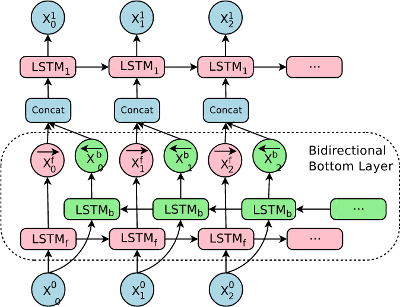
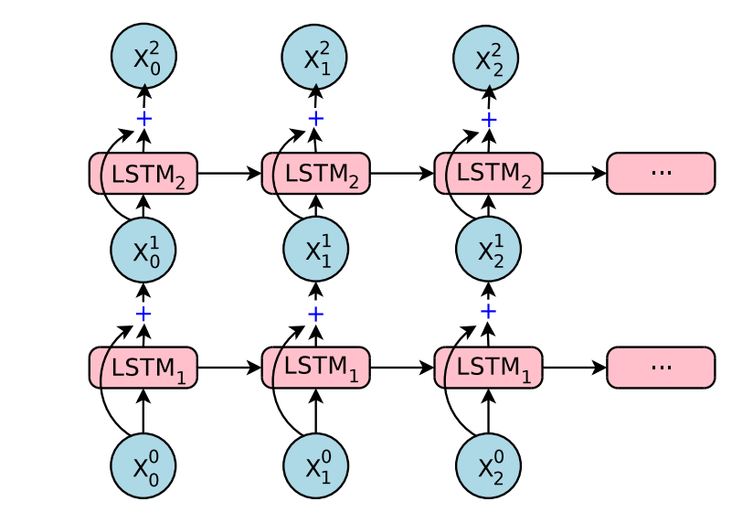
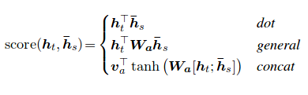

# Better RNN Components
Tensorflow RNN components implemented as simply as possible.

## Contents
* [RNN CELLS](#rnn-cells)
  * [RNN Cell](#rnn-cell)
  * [LSTM Cell](#lstm-cell)
  * [LSTM Cell with Peepholes](#lstm-cell-with-peepholes)
  * [mLSTM Cell with Peepholes](#mlstm-cell-with-peepholes)
  * [mLSTM Cell with L2 regularization](#mlstm-cell-with-l2-regularization)
  * [GRU Cell](#gru-cell)
* [RNN Presets](#rnn-presets)
  * [Bidirectional LSTM](#bidirectional-lstm)
  * [Bidirectional GRU](#bidirectional-gru)
  * [Stacked LSTM](#stacked-lstm)
  * [Stacked GRU](#stacked-gru)
* [Attention Mechanisms](#attention-mechanisms)
  * [Luong Attention Mechanism](#luong-attention-mechanism)
  * [Bahdanau Attention Mechanism](#bahdanau-attention-mechanism)
  * [Temporal Attention Mechanism](#temporal-attention-mechanism)
  * [Decoder Attention Mechanism](#decoder-attention-mechanism)
* [Self Critical Loss Function](#self-critical-loss-function)
* [Papers](#papers)

## RNN CELLS
A collection of different variants of RNN, LSTM, and GRU cells.

### RNN Cell
Simplest of RNN cells, features a single sigmoid layer at each time step.

### LSTM Cell
Basic LSTM cell as described in [Long Short-Term Memory](http://www.bioinf.jku.at/publications/older/2604.pdf) with optional dropout. For simplicity purposes, all of the mathematical logic is made clearly visibile and is implemented in a minimalistic fashion:
```python
def lstm_cell(x, c, h, units, scope='lstm_cell', 
    w_init=tf.random_normal_initializer(stddev=0.02), 
    b_init=tf.constant_initializer(0),
    f_b=1.0, i_kp=1.0, o_kp=1.0):
    with tf.variable_scope(scope):
        w_dim = shape_list(x)[1] + shape_list(h)[1]
        w = tf.get_variable("w", [w_dim, units * 4], initializer=w_init)
        b = tf.get_variable("b", [units * 4], initializer=b_init)
        x = _rnn_dropout(x, i_kp)
        z = tf.matmul(tf.concat([x, h], 1), w) + b
        i, j, f, o = tf.split(z, 4, 1)
        c = tf.nn.sigmoid(f + f_b) * c + tf.nn.sigmoid(i) * tf.tanh(j)
        h = tf.nn.sigmoid(o) * tf.tanh(c)
        h = _rnn_dropout(h, o_kp)
        return h, c
```

### LSTM Cell with Peepholes
LSTM cell similar to the one above but with added peepholes as described in [Long Short-Term Memory Recurrent Neural Network Architectures for Large Scale Acoustic Modeling](https://static.googleusercontent.com/media/research.google.com/en//pubs/archive/43905.pdf).

### mLSTM Cell
Multiplicative variant of LSTM as described in [Multiplicative LSTM For Sequence Modeling](https://arxiv.org/pdf/1609.07959.pdf). mLSTM is able to use different recurrent transition functions for every possible input, allowing it to be more expressive for autoregressive sequence modeling. mLSTM outperforms standard LSTM and its deeper variants in many sequence modeling tasks.

### mLSTM Cell with Peepholes
Multiplicative LSTM with peepholes, combines the concepts of the above two cells.

### mLSTM Cell with L2 regularization
Multiplicative LSTM cell with L2 regularization as described in [L2 Regularization for Learning Kernels](https://arxiv.org/pdf/1205.2653.pdf).

### GRU Cell
GRU cell as described in [Learning Phrase Representations using RNN Encoder–Decoder for Statistical Machine Translation](https://arxiv.org/pdf/1406.1078.pdf). GRU cells have shown similar performance to the more popular LSTM cells despite having less trainable parameters.

## RNN Presets
Several preset RNNs to use in your code or as a reference.

### Bidirectional LSTM
Encodes inputs in forward and reverse time order and then concatenates the resulting outputs and states using an LSTM cell. The bidirectional lstm has shown impressive results when used as the first layer in Googles GNMT translation model described in [Google’s Neural Machine Translation System: Bridging the Gap
between Human and Machine Translation](https://arxiv.org/pdf/1609.08144.pdf).


### Bidirectional GRU
Encodes inputs in forward and reverse time order and then concatenates the resulting outputs and states using an GRU cell.

### Stacked LSTM
An rnn that encodes input using a stack of LSTM cells with optional residual connections after a specified depth. Googles GNMT translation model features two stacked LSTM's, one further encoding the output of the bidirectional lstm followed by a second to decode the output of the stacked encoder.



### Stacked GRU
An rnn that encodes input using a stack of GRU cells with optional residual connections after a specified depth.

## Attention Mechanisms


### Luong Attention Mechanism
Luong attention function as described in [Effective Approaches to Attention-based Neural Machine Translation](https://arxiv.org/pdf/1508.04025.pdf). At every decoding step, an attention mechanism produced a probability distribution allowing the decoder to focus on specific parts of the encoder output with varying levels of "attention" or emphasis. Given "query" h[t] (the decoder cell output at time t) and h[s] (the sth encoder output) the luong score for h[s] is computed using the below equation afterwhich all of the scores are normalized using a softmax.
    score(h[t], h[s]) = h[t] . W . h[s]

### Bahdanau Attention Mechanism

### Temporal Attention Mechanism

### Decoder Attention Mechanism

## Self Critical Loss Function

Self critical loss function as described in [A Deep Reinforced Model for Abstractive
Summarization](https://arxiv.org/pdf/1705.04304.pdf) to reward objective function in addition to typical cross entropy loss used for seq2seq machine learning tasks. Pseudocode for loss below:
    
    ml_losses = cross_entropy(logits, targets)
    rl_losses = (metric(sampled_outputs, targets) - metric(greedy_outputs, targets)) * cross_entropy(logits, sample_outputs)
    losses = gamma * rl_losses + (1 - gamma) * ml_losses

## Papers
